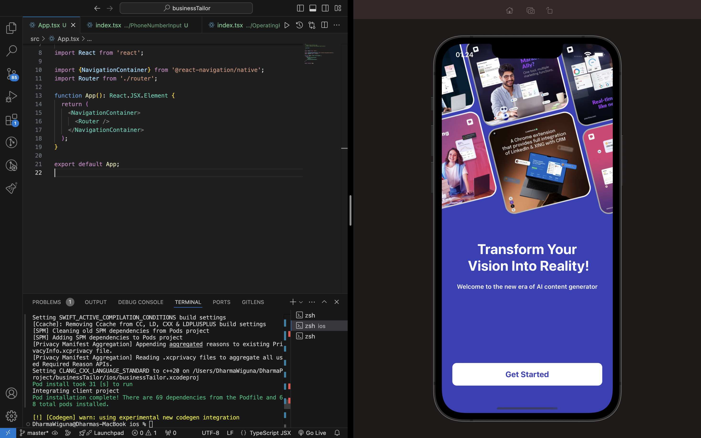

# Project Name

## [](https://reactnative.dev/) [](https://opensource.org/licenses/MIT)

## App Screenshot


**Image**: Example of the main screen of the app.

## Demo Video

Watch the app demo on YouTube for a visual guide on how it works:  
[](https://youtu.be/U3SsffrsL68)

---

## Getting Started

Follow these steps to run the project on your local environment.

### 1. Clone the Repository

```bash
git clone https://github.com/dharmawiguna/the-business-tailor.git
cd repo-name
```

### 2. Install Dependencies

```bash
npm install
# or if using yarn
yarn install
```

### 2. Run on Emulator or Device

```bash
npx react-native run-android
# or run on ios
npx react-native run-ios
```
